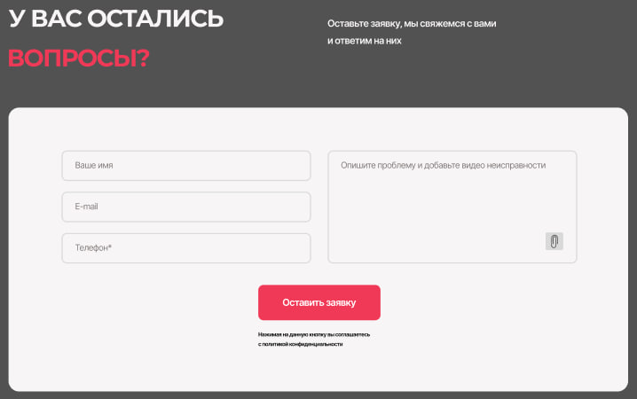

# BEM
## Human body

head
head__eyes
head__nose
head__mouth
head__eyes--closed
head__nose--frosty
head__mouth--smiling
body
body__breast
body__back
body__stomach
body__breast--size-b
body__back--crooked
body__stomach--flat
arms
arms__hands
arms__fingers
arms__fingernails
arms__hands--tattoed
arms__fingers--w-ring
arms__fingernails--color-red
legs
legs__hips
legs__toes
legs__toenails
legs__hips--w-scar
legs__toes--hairy
legs__toenails--shiny

## Layout
### Header

```
    header.header>div.header__wrapper>a.header__logo.logo>img.logo__img^nav.header__nav.nav>ul.nav__list>li.nav__item*4>a.nav__link*4^^^a.nav__phone
```


### Form

```
    section.form>div.form__wrapper>h2.form__heading+p.form__description+form.form>(label.form__label+input.form__input)*4+button.form__button+p.form__notification
```


### Card

```
    section.card>div.card__wrapper>h2.card__heading+p.card__description+ul.card__list>(li.card__items.items>img.items__image+p.items__heading+p.items__description+a.items__button)*5
```


### Section

```
    section.benefits>div.benefits__wrapper>h2.benefits__heading+p.benefits__decription+ul.benefits__list>(li.benefits__card.card>img.card__icon+p.card__heading+p.card__description)*3
```
